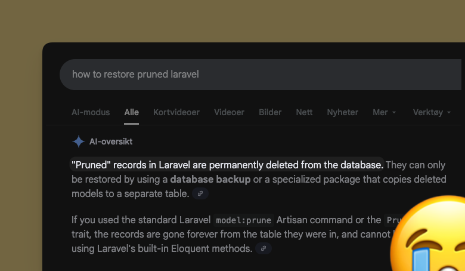

# Prunekeeper

**Archive prunable Eloquent records before deletion.**

[](https://packagist.org/packages/helgesverre/laravel-prunekeeper)
[](https://packagist.org/packages/helgesverre/laravel-prunekeeper)
[](https://packagist.org/packages/helgesverre/laravel-prunekeeper)



---

Laravel's `Prunable` trait lets you automatically clean up old database records. <br> But once they're gone, they're
gone forever.

Prunekeeper hooks into Laravel's pruning process to export records to CSV or SQL before deletion. Archives are
compressed and uploaded to any Laravel filesystem disk (S3, local, etc.), giving you a safety net for compliance,
auditing, or "just in case."

```php
class Flight extends Model
{
    use Prunable;
    use ArchivePrunedRecords; // Add this trait

    public function prunable(): Builder
    {
        return static::where('created_at', '<=', now()->subYear());
    }
}
```

When you run `php artisan model:prune`, Prunekeeper automatically:

1. Exports matching records to CSV (or SQL)
2. Compresses the export (ZIP, gzip, bzip2, or tar.gz)
3. Uploads to your configured storage disk
4. Allows Laravel to proceed with deletion

## Installation

```bash
composer require helgesverre/laravel-prunekeeper
```

Optionally publish the configuration:

```bash
php artisan vendor:publish --tag="prunekeeper-config"
```

**Requirements:** PHP 8.2+ and Laravel 11 or 12.

## Basic Usage

Add the `ArchivePrunedRecords` trait to any model that uses Laravel's `Prunable` or `MassPrunable` trait:

```php
use Illuminate\Database\Eloquent\Model;
use Illuminate\Database\Eloquent\Prunable;
use HelgeSverre\Prunekeeper\ArchivePrunedRecords;

class Flight extends Model
{
    use Prunable;
    use ArchivePrunedRecords;

    public function prunable(): Builder
    {
        return static::where('created_at', '<=', now()->subMonth());
    }
}
```

That's it. When Laravel prunes the model, Prunekeeper archives the records first.

### Using with MassPrunable

Works the same way with `MassPrunable` (bulk deletion without model events):

```php
use Illuminate\Database\Eloquent\MassPrunable;
use HelgeSverre\Prunekeeper\ArchivePrunedRecords;

class Flight extends Model
{
    use MassPrunable;
    use ArchivePrunedRecords;

    public function prunable(): Builder
    {
        return static::where('created_at', '<=', now()->subMonth());
    }
}
```

## Configuration

```php
return [
    // Storage disk (any Laravel filesystem disk)
    'disk' => env('PRUNEKEEPER_DISK', 's3'),

    // Base path for archived files
    'path' => env('PRUNEKEEPER_PATH', 'prunable-exports'),

    // Export format: 'csv' or 'sql'
    'format' => env('PRUNEKEEPER_FORMAT', 'csv'),

    // Compression settings
    'compression' => [
        'enabled' => env('PRUNEKEEPER_COMPRESS', true),
        'driver' => env('PRUNEKEEPER_COMPRESSION_DRIVER', 'zip'), // zip, gzip, targz, bzip2
    ],

    // Records per chunk when exporting
    'chunk_size' => env('PRUNEKEEPER_CHUNK_SIZE', 1000),

    // Enable/disable archiving globally
    'enabled' => env('PRUNEKEEPER_ENABLED', true),

    // Continue pruning if archiving fails
    'fail_silently' => env('PRUNEKEEPER_FAIL_SILENTLY', false),

    // Clean up temporary files after upload
    'cleanup_temp_files' => true,

    // Paths for model discovery (supports glob patterns)
    'models_path' => ['app/Models', 'app'],
];
```

### Export Formats

| Format            | Description                       | Best For                                       |
| ----------------- | --------------------------------- | ---------------------------------------------- |
| **CSV** (default) | Portable, database-agnostic       | General archiving, analytics, data portability |
| **SQL**           | Database-specific `INSERT` statements | Direct database restoration                 |

SQL exports automatically use the correct identifier quoting for your database:
- **MySQL/MariaDB:** backticks (`` ` ``)
- **PostgreSQL/SQLite:** double quotes (`"`)
- **SQL Server:** square brackets (`[]`)

### Compression Drivers

Choose from multiple compression formats:

| Driver | Extension | Requirements |
|--------|-----------|--------------|
| `zip` (default) | `.zip` | ext-zip |
| `gzip` | `.gz` | ext-zlib |
| `bzip2` | `.bz2` | ext-bz2 |
| `targz` | `.tar.gz` | ext-phar, ext-zlib, phar.readonly=0 |

Configure in `config/prunekeeper.php` or via environment:

```bash
PRUNEKEEPER_COMPRESSION_DRIVER=gzip
```

## Artisan Commands

### Archive without deleting

Archive records without triggering deletion:

```bash
# Archive all models with the trait
php artisan prunekeeper:archive

# Archive a specific model
php artisan prunekeeper:archive --model="App\Models\Flight"

# Preview what would be archived
php artisan prunekeeper:archive --pretend

# Override format
php artisan prunekeeper:archive --format=sql

# Skip compression
php artisan prunekeeper:archive --no-compress

# Use specific compression driver
php artisan prunekeeper:archive --compression=gzip
```

### Validate configuration

Validate that column configurations are correct:

```bash
php artisan prunekeeper:validate
```

Run this in CI/CD to catch configuration errors before deployment.

## Customization

### Export specific columns

By default, all columns are exported. To limit which columns are archived:

```php
class Flight extends Model
{
    use Prunable, ArchivePrunedRecords;

    public function getArchivableColumns(): ?array
    {
        return ['id', 'number', 'destination', 'created_at'];
    }
}
```

If you specify columns that don't exist, Prunekeeper throws an `InvalidColumnException` with a helpful message showing
available columns.

### Exclude sensitive columns globally

Apply column filtering across all models. Configure Prunekeeper in a service provider's `boot` method:

```php
use HelgeSverre\Prunekeeper\Prunekeeper;

Prunekeeper::resolveColumnsUsing(function ($model) {
    $allColumns = Schema::getColumnListing($model->getTable());

    return array_diff($allColumns, [
        'password',
        'remember_token',
        'api_key',
        'ssn',
    ]);
});
```

### Custom filename

Override the default filename pattern globally:

```php
use HelgeSverre\Prunekeeper\Prunekeeper;

Prunekeeper::generateFilenameUsing(function ($model, $format) {
    return sprintf('archives/%s/%s-%s.%s',
        now()->format('Y/m'),
        now()->format('Y-m-d_His'),
        $model->getTable(),
        $format
    );
});
```

Or per-model:

```php
class Flight extends Model
{
    use Prunable, ArchivePrunedRecords;

    public function getArchiveFilename(string $format): ?string
    {
        return "flight-logs/{$this->getTable()}-" . now()->format('Y-m-d') . ".{$format}";
    }
}
```

### Lifecycle hooks

Hook into the archiving process:

```php
use HelgeSverre\Prunekeeper\Prunekeeper;

Prunekeeper::beforeArchiving(function ($model) {
    Log::info("Starting archive for {$model->getTable()}");
});

Prunekeeper::afterArchiving(function ($model, $result) {
    Log::info("Archived {$result->recordCount} records to {$result->storagePath}");

    // Send notification, update metrics, etc.
});
```

### Events

Prunekeeper dispatches Laravel events for integration with queues, notifications, or monitoring:

```php
use HelgeSverre\Prunekeeper\Events\ArchiveStarting;
use HelgeSverre\Prunekeeper\Events\ArchiveCompleted;
use HelgeSverre\Prunekeeper\Events\ArchiveFailed;
use HelgeSverre\Prunekeeper\Events\ArchiveSkipped;

// In EventServiceProvider or via Event::listen()
Event::listen(ArchiveStarting::class, function ($event) {
    // $event->model - the model instance
    // $event->recordCount - number of records to archive
});

Event::listen(ArchiveCompleted::class, function ($event) {
    // $event->model - the model instance
    // $event->result - ArchiveResult with path, size, format, etc.
});

Event::listen(ArchiveFailed::class, function ($event) {
    // $event->model - the model instance
    // $event->exception - the exception that occurred
});

Event::listen(ArchiveSkipped::class, function ($event) {
    // $event->model - the model instance
    // $event->reason - ArchiveSkipped::REASON_* constant
});
```

| Event | Dispatched When |
|-------|-----------------|
| `ArchiveStarting` | Before archive begins |
| `ArchiveCompleted` | After successful archive |
| `ArchiveFailed` | When archive fails |
| `ArchiveSkipped` | When archive is skipped (disabled, no records, pretend mode) |

### Disable archiving conditionally

Disable archiving for specific models or environments:

```php
class Flight extends Model
{
    use Prunable, ArchivePrunedRecords;

    public function shouldArchiveBeforePruning(): bool
    {
        return app()->isProduction();
    }
}
```

### Model discovery

The `prunekeeper:archive` and `prunekeeper:validate` commands auto-discover models using the `ArchivePrunedRecords` trait.

By default, models are discovered in `app/Models` and `app/`. Configure custom paths:

```php
// config/prunekeeper.php
'models_path' => ['app/Models', 'app/Domain/*/Models'],
```

**Glob patterns** are supported:

| Pattern | Matches |
|---------|---------|
| `app/Models` | Standard Laravel location |
| `app/Domain/*/Models` | `app/Domain/Users/Models`, `app/Domain/Orders/Models`, etc. |
| `app/Modules/**/Models` | Recursively finds all `Models` directories under `app/Modules/` |

You can also specify models directly via the `--model` option:

```bash
php artisan prunekeeper:archive --model="App\Models\Flight"
```

## Scheduling

Add pruning to your scheduler in `routes/console.php`:

```php
use Illuminate\Support\Facades\Schedule;

Schedule::command('model:prune')->daily();
```

Or in Laravel 11+ with `bootstrap/app.php`:

```php
->withSchedule(function (Schedule $schedule) {
    $schedule->command('model:prune')->daily();
})
```

Preview what will be pruned:

```bash
php artisan model:prune --pretend
```

## Performance

Prunekeeper handles large datasets efficiently:

- **Chunked processing**: Records are exported in configurable chunks (default: 1000)
- **Streamed uploads**: Files are streamed to storage, not loaded entirely into memory
- **Configurable chunk size**: Adjust `PRUNEKEEPER_CHUNK_SIZE` based on your constraints

For very large tables (millions of records):

- Run `prunekeeper:archive` during off-peak hours
- Use a dedicated queue worker for the prune command
- Increase `chunk_size` if memory allows (improves speed)

## Security

When archiving data that may contain sensitive information:

1. **Use column filtering**: Implement `getArchivableColumns()` or use `resolveColumnsUsing()` to exclude sensitive
   fields
2. **Use secure storage**: Configure your storage disk with appropriate access controls and encryption
3. **Run validation**: Use `prunekeeper:validate` in CI/CD to catch configuration errors

## Testing

```bash
composer test
```

## Changelog

See [CHANGELOG](CHANGELOG.md) for version history.

## Contributing

Contributions are welcome! Please see the repository for guidelines.

## Security

If you discover a security vulnerability, please email helge.sverre@gmail.com instead of using the issue tracker.

## Credits

- [Helge Sverre](https://github.com/HelgeSverre)

## License

The MIT License (MIT). See [LICENSE](LICENSE.md) for details.
